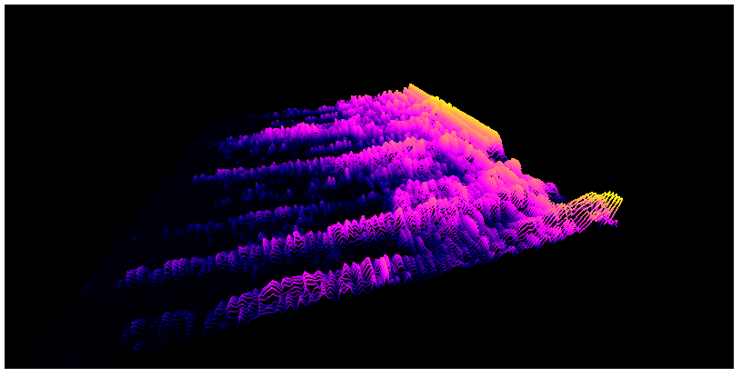
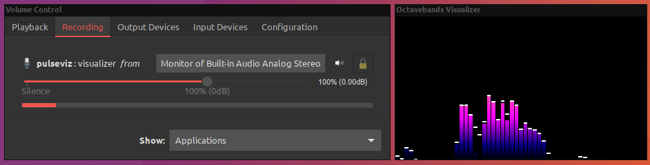

# pulseviz

... is going to be a light-weight configurable OpenGL-accelerated audio visualizer for PulseAudio written in C++11. It is supposed to supersede my older [pulseviz.py](https://github.com/pckbls/pulseviz.py) Python project as it turned out, Python might be a bit too slow for this kind of application.



# Installation

## Dependencies

* `glfw`
* `glew`
* `glm`
* `libpulse` and `libpulse-simple`
* `fftw3`

## Build and run pulseviz

```sh
mkdir build && cd build && cmake -DCMAKE_BUILD_TYPE=Release .. && make && ./pulseviz
```

# Usage

## Key bindings

| Key   | Function                                                       |
|-------|----------------------------------------------------------------|
| q     | Quit                                                           |
| c     | Create new window (this might not work correctly at all times) |
| Space | Change visualization                                           |

## Change input source

`pavucontrol` can be used to change the input source that pulseviz gets its audio signal from.



